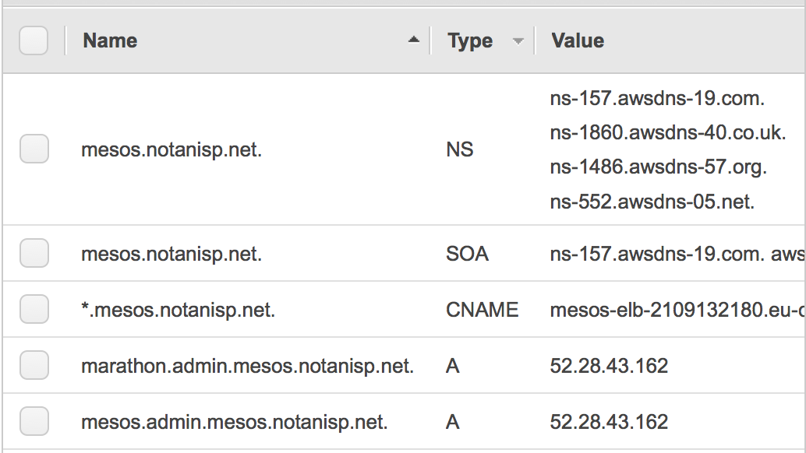

# terraform-example-mesos-cluster

This repository builds out an example VPC, running [Mesos](http://mesos.apache.org/) and [Marathon](https://github.com/mesosphere/marathon),
and a redundant setup, with load balancing and service discovery so that services registered in Marathon
automatically get a pubicly accessible URI

## Dependencies

  * [my fork](https://github.com/bobtfish/terraform) of [terraform](https://www.terraform.io/)
  * [the aws cli tool](http://aws.amazon.com/cli/) installed
  * an [~/.aws/credentials file](http://docs.aws.amazon.com/cli/latest/userguide/cli-chap-getting-started.html#cli-config-files) with a _[demo]_ section
  * A domain name, which you can delegate a subdomain of, for example I have notanisp.net, so this repos uses mesos.notanisp.net

## Quickstart - running it

    make
    cd eucentral1-demo
    vi terraform.tfvars # Fix the domain variable to your subdomain, e.g mesos.notanisp.net
    make
    terraform apply

    # Your subdomain will now appear in the AWS Route53 console - grab the name servers:
    

## See also

  * https://github.com/bobtfish/tf_aws_mesos
  * http://bobtfish.github.io/blog/2015/04/03/terraform-0-dot-4-0/
  * http://bobtfish.github.io/blog/2015/03/29/terraform-from-the-ground-up/
  * https://github.com/bobtfish/terraform-vpc-nat
  * https://github.com/bobtfish/terraform-vpc
  * https://github.com/bobtfish/terraform-azs
  * https://github.com/bobtfish/terraform-community-modules/tf_aws_ubuntu_ami

